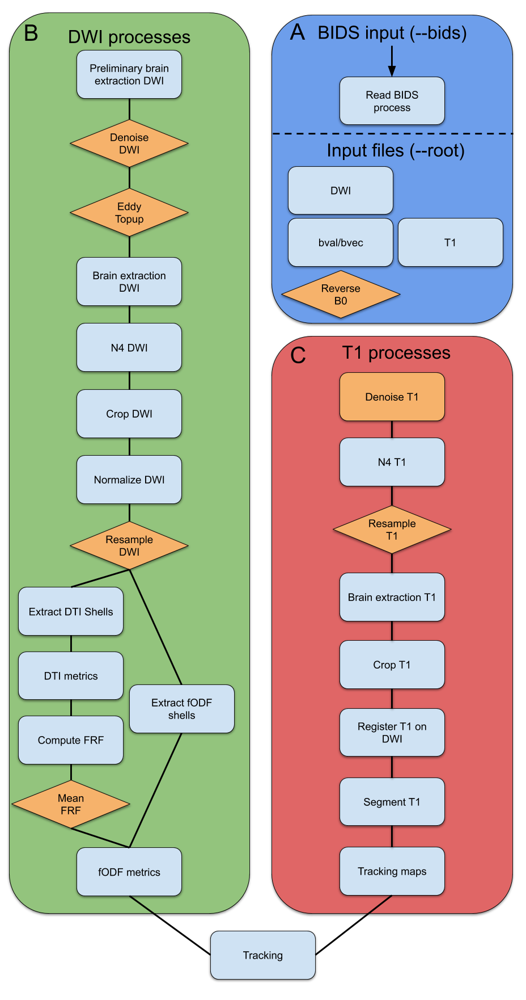

Processing steps
================

Extractor_flow pipeline consists of XX different steps.

The very first step is to check if the original data (anatomical T1 and whole brain tractogram) are already in the MNI stereotactic space. If not, the brain is first extracted on the participant's T1 image if necessary `(antsBrainExtraction.sh) <https://github.com/ANTsX/ANTs/blob/master/Scripts/antsBrainExtraction.sh>`_ and then realigned to the T1 image of the JHU template `(antsRegistrationSyN.sh) <https://github.com/ANTsX/ANTs/blob/master/Scripts/antsRegistrationSyN.sh>`_ using ANTs tools **(Avants et al., 2009)**. Both linear and non-linear registration matrices are then applied to the tractogram `(scil_apply_transform_to_tractogram.py) <https://scilpy.readthedocs.io/en/latest/scripts/scil_apply_transform_to_tractogram.html>`_.

Step 1
------
 The first filtering step is to remove the streamlines that are out of the volume bounding box `(scil_remove_invalid_streamlines.py) <https://scilpy.readthedocs.io/en/latest/scripts/scil_remove_invalid_streamlines.html>`_. No negative coordinate and no above volume dimension coordinate are possible in voxel space. Any streamline that does not respect these two conditions is cut to keep its most extended segment within the bounding box. Note that this step is skipped if the original whole-brain tractogram was built within the TractoFlow framework **(Theaud et al., 2020)** that already runs this step.

Step 2
------
This step consists of filtering the streamlines according to their geometrical and anatomical ending properties `(scil_filter_tractogram_anatomically.py) <https://scilpy.readthedocs.io/en/latest/scripts/scil_filter_tractogram_anatomically.html>`_. 
It is performed sequentially in four sub-steps, each processing the data on the output of the previous one. 
It first removes the streamlines with a length shorter than 20 mm. It then removes streamlines making a loop of 360°. 
The third sub-step filters out the streamlines traveling through the main sulci of the JHU template by using an adapted ROI *(JHU_MIN_all_shell_limits_f.nii.gz)* built with the gyral shells (Cf. additional JHU template ROIs).
The last sub-step is filtering out the streamlines with at least one termination within the deep WM ROIs of the JHU template by keeping the streamlines with both ends in an adapted ROI encompassing all the ROIs of the JHU template except the DWM ones *(JHU_MNI_all_noDWM.nii.gz)*.

Step 3
------
This step extracts the plausible streamlines belonging to the fornix and the hippocampal commissure (HC).

.. warning:: At this stage, in addition to the streamlines of the fornix and the hippocampal commissure set aside, the original whole-brain tractogram is split into two sub-tractograms, one with all the streamlines already considered anatomically implausible, the other with all the streamlines remaining to be filtered. Note that the user can choose to keep every set of streamlines filtered out along the different steps of ExtractorFlow. The folder Extract_first_unplausible contains a sub-tractogram with the anatomically implausible streamlines extracted with steps 1, 2, and 3.

Step 4
------
This step sets aside all the streamlines with at least one termination in any ROI belonging to the cerebellum in the JHU template. The subsequent cerebellar sub-tractogram is then filtered out to extract anatomically plausible cerebellar streamlines. It is performed in parallel in five sub-steps, each filtering out plausible cerebellar streamlines corresponding to intra-cerebellar, medulla-cerebellar, pontine-cerebellar, midbrain-cerebellar, and cerebellar fibers connected with the red nucleus and the thalamus, respectively.
All these plausible cerebellar streamlines are then grouped in a plausible cerebellar sub-tractogram available in the folder ******, along with the sub-tractogram of implausible cerebellar streamlines obtained by subtracting the plausible ones from all the cerebellar streamlines set aside initially in this step 4.

Step 5
------
This step sets aside all the streamlines with at least one termination in the brainstem, except those with the other termination in the brainstem already filtered out in step 4. The subsequent brainstem sub-tractogram is then filtered out to extract anatomically plausible projection streamlines terminating in the brainstem. We consider here two types of streamlines: those with both ends in the brainstem, namely within the medulla, the pons, and the midbrain, and those with one end in the brainstem and the other in the rest of the brain, namely in the thalamus, the red nucleus, the midbrain (cortico-tectal fibers), and the cortex (fronto-pontine, parieto-temporo-occipito-pontine, and pyramidal fibers.
All these plausible brainstem streamlines are then grouped in a plausible brainstem sub-tractogram available in the folder ******, along with the sub-tractogram of implausible brainstem streamlines obtained by subtracting the plausible ones from all the brainstem streamlines set aside initially in this step 5.

Step 6
------
At this stage, the remaining streamlines not yet filtered are only made up of fibers with two ends outside the cerebellum and the brainstem. This step splits them into a cortical sub-tractogram composed of streamlines with at least one termination in the CGM or the SWM and a sub-cortical sub-tractogram composed of streamlines with both ends in the grey nuclei.

Step 7
------
This step separates the commissural streamlines from the cortical sub-tractogram by filtering out all the streamline passing through an adapted ROI (JHU_MIN_Midline.nii.gz). The commissural sub-tractogram filtering is then performed in 28 parallel sub-steps. One sub-step extracts the plausible streamlines passing through the anterior commissure using, among others, some adapted ROIS (JHU_MNI_AC.nii.gz; JHU_MNI_AC_not_Fx.nii.gz; JHU_MNI_Sylvius_L/R.nii.gz). Another sub-step extracts the plausible streamlines connecting the basal ganglia with the contralateral cortex through the corpus callosum (De Benedictis et al., 2016). The remaining 26 sub-steps filter out the homotopic callosal streamlines for each gyrus composing the CGM of the JHU template. Note that in the absence of a comprehensive definition of heterotopic callosal connection pathways except for the frontal cortex (De Benedictis et al., 2016), ExtractorFlow does not currently consider any heterotopic callosal fibers as plausible. Such filtering will be incorporated once a complete description of these heterotopic callosal fibers is revealed.

Step 8
------

Step 9
------

References

Avants, B.B., Tustison, N.J., Song, G., 2009. Advanced normalization tools (ANTS). Insight Journal 2, 1-35.

De Benedictis, A., Petit, L., Descoteaux, M., Marras, C.E., Barbareschi, M., Corsini, F., Dallabona, M., Chioffi, F., Sarubbo, S., 2016. New insights in the homotopic and heterotopic connectivity of the frontal portion of the human corpus callosum revealed by microdissection and diffusion tractography. Hum Brain Mapp 37, 4718-4735.

Theaud, G., Houde, J.C., Bore, A., Rheault, F., Morency, F., Descoteaux, M., 2020. TractoFlow: A robust, efficient and reproducible diffusion MRI pipeline leveraging Nextflow & Singularity. NeuroImage 218, 116889.

